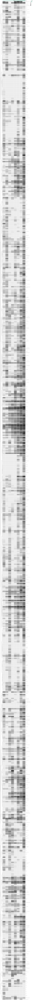

# PRISMBroadScreen — Hagenbeek et al., Nature Communications 2026

Broad single-agent dose-response screen (PRISM) with integrated multi-omics biomarker analysis across a large panel of cancer cell lines.

**Publication:** Hagenbeek et al., *Nature Communications* 2026 (accepted, link to be updated)

## At a glance

| | |
|---|---|
| **Cell lines** | 774 (pan-cancer) |
| **Drug** | GDC-8025 (TEAD1/2/3/4 inhibitor) |
| **Analysis type** | Single-agent broad screen + biomarker discovery |
| **Metrics** | RV (relative viability) |
| **Omics integration** | Copy number, gene expression, somatic mutations |

## Drug

| Drug | Target (MOA) |
|------|-------------|
| GDC-8025 | TEAD1, TEAD2, TEAD3, TEAD4 |

## Reports

| Step | Report | Description |
|------|--------|-------------|
| 1 | [data_import](1-data_import.html) | Import PRISM screen data into gDR format |
| 2 | [processing_and_QC](2-processing_and_QC.html) | Dose-response processing and quality control |
| 3 | [analysis](3-analysis.html) | Dose-response analysis and visualization |
| 3-1 | [PRISM_analysis](3-1-PRISM_analysis.html) | Biomarker analysis with DepMap omics data |

## Preview

  

## Data

| Directory | Contents |
|-----------|----------|
| `raw_data/` | Raw PRISM screen data |
| `raw_data/meta/` | DepMap omics matrices (CN, expression, mutations) — stored via **Git LFS** |
| `data_annotation/` | Cell line and drug annotation CSVs |
| `gDR_data/` | Processed MultiAssayExperiment objects (`.qs2`) |
| `plots/` | Generated SVG figures |
| `tables/` | Result tables (`.xlsx`) |

> **Note:** Large omics files in `raw_data/meta/` are tracked with Git LFS. Make sure you have [Git LFS](https://git-lfs.github.com/) installed before cloning.
