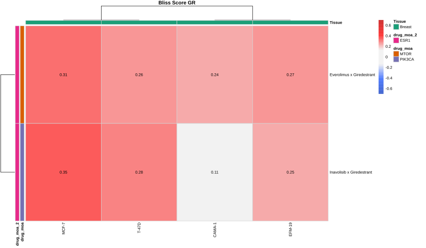

# SmallDrugCombo — Zhou et al., Cell Chemical Biology 2026

Drug combination screen analyzing synergy between targeted therapies in ER+ breast cancer cell lines.

**Publication:** [Zhou et al., *Cell Chemical Biology* 2026](https://www.cell.com/cell-chemical-biology/fulltext/S2451-9456(26)00143-1)

## At a glance

| | |
|---|---|
| **Cell lines** | 4 (CAMA-1, EFM-19, MCF-7, T-47D) |
| **Tissue** | Breast |
| **Combinations** | Inavolisib × Giredestrant, Everolimus × Giredestrant |
| **Analysis type** | Drug combination (synergy) |
| **Metrics** | GR, RV, Bliss excess, HSA excess |

## Drugs

| Drug | Target (MOA) |
|------|-------------|
| Giredestrant | ESR1 |
| Inavolisib | PIK3CA |
| Everolimus | MTOR |

## Reports

| Step | Report | Description |
|------|--------|-------------|
| 1 | [data_import](1-data_import.html) | Import raw Excel files into gDR format |
| 2 | [processing_and_QC](2-processing_and_QC.html) | Dose-response processing and quality control |
| 3 | [analysis](3-analysis.html) | Synergy analysis (Bliss, HSA) and visualization |

## Preview

  

## Data

| Directory | Contents |
|-----------|----------|
| `raw_data/` | Raw treatment and manifest Excel files |
| `data_annotation/` | Cell line and drug annotation CSVs |
| `gDR_data/` | Processed MultiAssayExperiment objects (`.qs2`) |
| `plots/` | Generated SVG figures |
| `tables/` | Result tables (`.xlsx`) |
